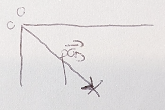
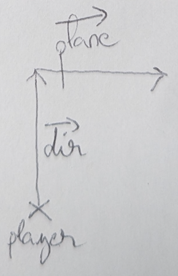
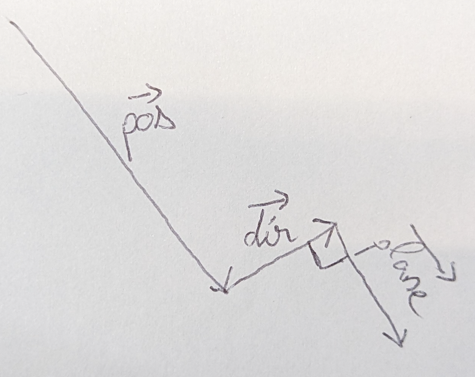
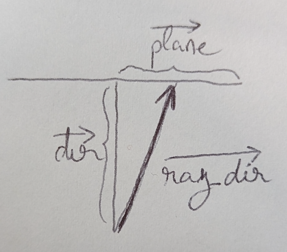
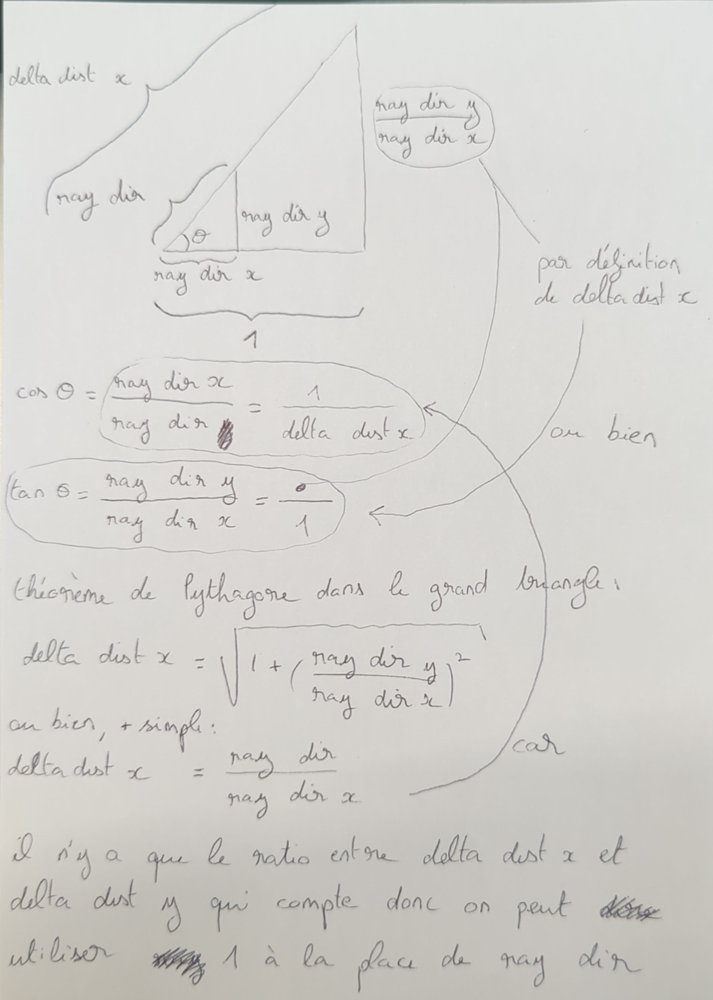
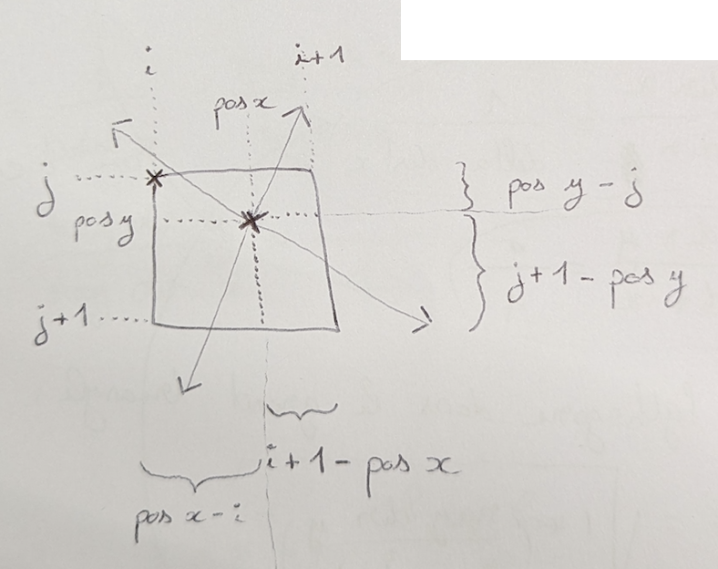
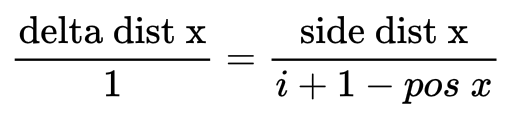

# <a href="https://lodev.org/cgtutor/raycasting.html" >bon site en anglais</a>

# <a href="https://guy-grave.developpez.com/tutoriels/jeux/doom-wolfenstein-raycasting/" >tuto developpez.com</a>

# pos

# dir_plane

# pos_dir_plane

# ray_dir

# comment calculer delta dist x et delta dist y

# pour initialiser les sides dist

exemple pour comprendre d'où sort le delta dist :

quand le rayon avance de delta dist x, il avance de 1 case suivant x

donc on a le produit en croix :

